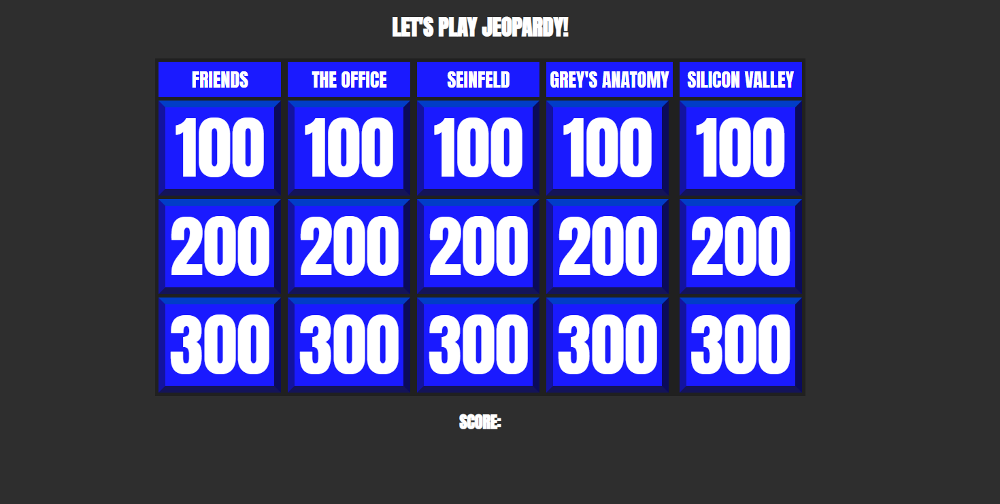
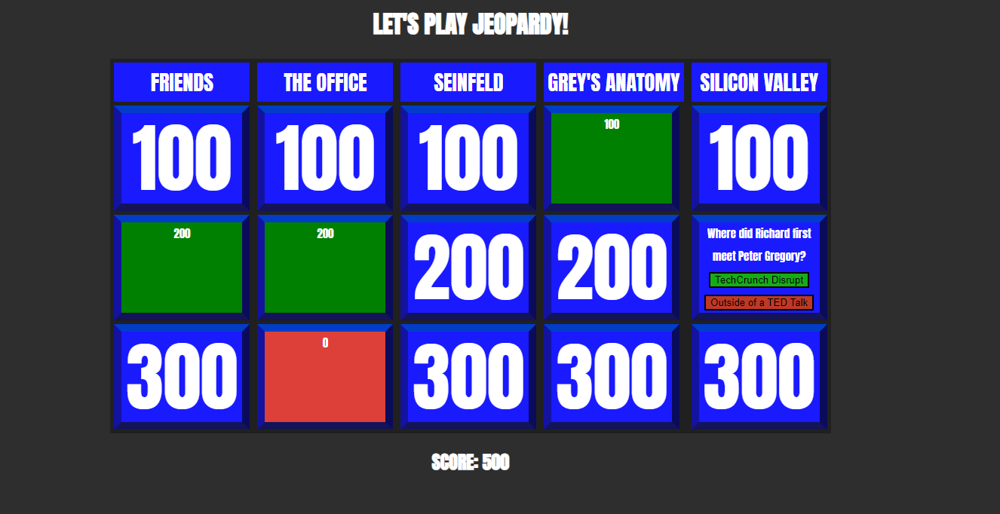

# JEOPARDY: TV Trivia Edition

## Overview

Jeopardy is a famous TV game show featuring trivia questions that contestants must answer while earning the highest score to win. This game is a vanilla JavaScript version of the game that features trivia questions from 5 TV shows. The questions range in difficulty from easy, medium and hard. As the difficulty increases with each question, so does the points awarded to the final score.

## Hosting

This site is currently hosted by Netlify.

## Live Site

The site can be currently accessed [here](https://caitlin-malloch-jeopardy.netlify.app/)

https://caitlin-malloch-jeopardy.netlify.app/

## UI Preview

The game starts with all 5 categories available and a score of 0.

As cards are turned, the question is revealed with two button options for the answers. The correct answers will reveal a green card and add the value to the final score. A worng answer reveals a red card and no value is added to the final score.

## Tech Stack

- HTML
- CSS
- JavaScript

## Developer

Caitlin Malloch

## License

MIT License

Copyright (c) 2023 Caitlin Malloch

Permission is hereby granted, free of charge, to any person obtaining a copy of this software and associated documentation files (the "Software"), to deal in the Software without restriction, including without limitation the rights to use, copy, modify, merge, publish, distribute, sublicense, and/or sell copies of the Software, and to permit persons to whom the Software is furnished to do so, subject to the following conditions:

The above copyright notice and this permission notice shall be included in all copies or substantial portions of the Software.

THE SOFTWARE IS PROVIDED "AS IS", WITHOUT WARRANTY OF ANY KIND, EXPRESS OR IMPLIED, INCLUDING BUT NOT LIMITED TO THE WARRANTIES OF MERCHANTABILITY, FITNESS FOR A PARTICULAR PURPOSE AND NONINFRINGEMENT. IN NO EVENT SHALL THE AUTHORS OR COPYRIGHT HOLDERS BE LIABLE FOR ANY CLAIM, DAMAGES OR OTHER LIABILITY, WHETHER IN AN ACTION OF CONTRACT, TORT OR OTHERWISE, ARISING FROM, OUT OF OR IN CONNECTION WITH THE SOFTWARE OR THE USE OR OTHER DEALINGS IN THE SOFTWARE.

## Acknowledgements

Ania Kubow YouTube Series: JavaScript Game Walkthroughs
